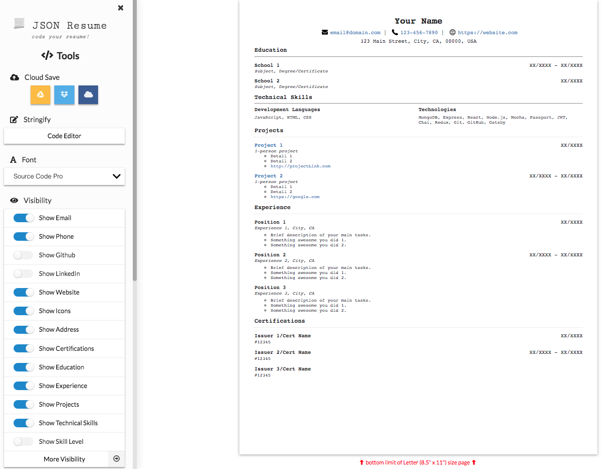

## Welcome to React Resume

This project helps create a resume from JSON code for downloading, printing, and auto-saving to Google Drive, Dropbox, or OneDrive.

This project was bootstrapped with [Create React App](https://github.com/facebook/create-react-app).

### Get started

In the project directory, you can run:

### `npm install`

Required to install dependencies for running locally.

### `npm start`

Runs the app in the development mode. Access it on [http://localhost:3000](http://localhost:3000).

The page will reload if you make edits. 
Keep the `Developer mode` active on your browser since runtime and lint errors may appear on the console.

### `npm test`

Launches the test runner in the interactive watch mode. 
See the section about [running tests](https://facebook.github.io/create-react-app/docs/running-tests) for more information.

### `npm run build`

Builds the app for production to the `build` folder. 
It correctly bundles React in production mode and optimizes the build for the best performance.

The build is minified and the filenames include the hashes. 
Your app is ready to be deployed!

See the section about [deployment](https://facebook.github.io/create-react-app/docs/deployment) for more information.

### `npm run eject`

**Note: this is a one-way operation. Once you `eject`, you can’t go back!**

If you aren’t satisfied with the build tool and configuration choices, you can `eject` at any time. This command will remove the single build dependency from your project.

Instead, it will copy all the configuration files and the transitive dependencies (Webpack, Babel, ESLint, etc) right into your project so you have full control over them. All of the commands except `eject` will still work, but they will point to the copied scripts so you can tweak them. At this point, you’re on your own.

You don’t have to ever use `eject`. The curated feature set is suitable for small and middle deployments, and you shouldn’t feel obligated to use this feature. However, we understand that this tool wouldn’t be useful if you couldn’t customize it when you are ready for it.

## Useful links

- [Create React App documentation](https://facebook.github.io/create-react-app/docs/getting-started)
- [React documentation](https://reactjs.org/)
- [Making a Progressive Web App](https://facebook.github.io/create-react-app/docs/making-a-progressive-web-app)
- [Deployment](https://facebook.github.io/create-react-app/docs/deployment)

### Our recommended skills improvers
- [Code Splitting](https://facebook.github.io/create-react-app/docs/code-splitting)
- [Analyzing the Bundle Size](https://facebook.github.io/create-react-app/docs/analyzing-the-bundle-size)
- [Advanced Configuration](https://facebook.github.io/create-react-app/docs/advanced-configuration)

## Got an error? Don't panic!
- [Troubleshooting](https://create-react-app.dev/docs/troubleshooting)

## Contributors

